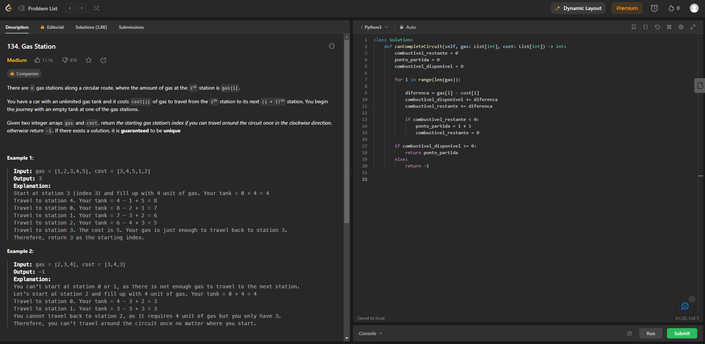
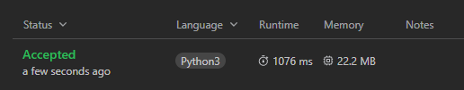
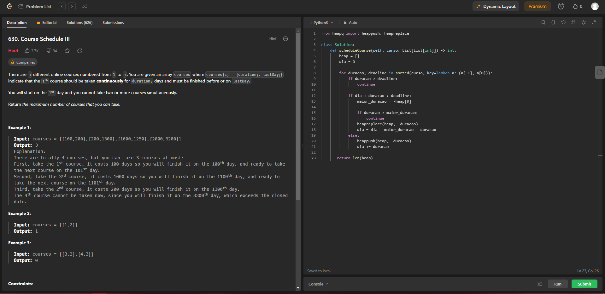
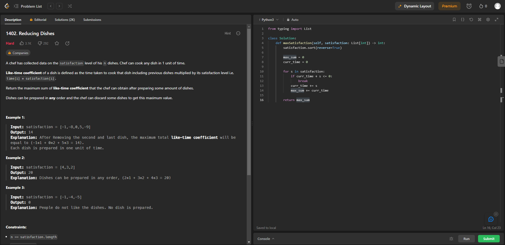
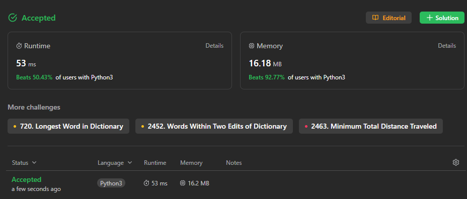
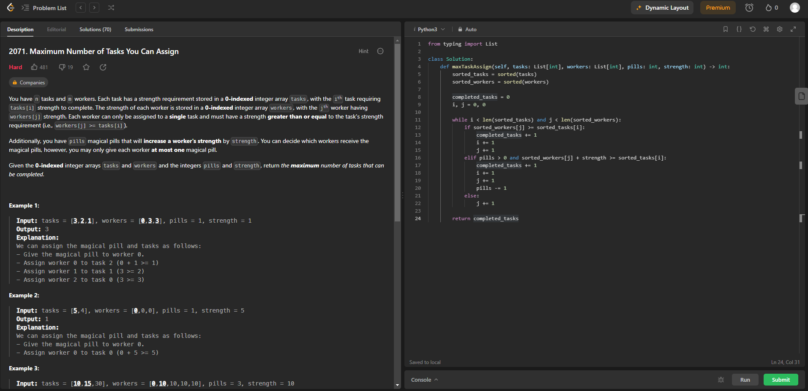
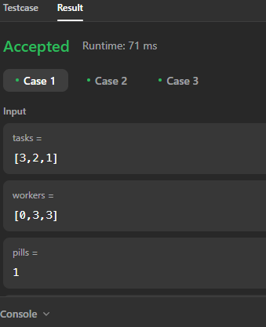

## Algoritmos Ambiciosos Exercicios Juiz Online
 
- Número na Lista : 33  
- Conteúdo da Disciplina: Greed  

## Alunos
|Matrícula | Aluno |
| -- | -- |
| 19/0142421  |  Artur Vinicius Dias Nunes |

## Sobre 
Exercicios resolvidos de juizes onlines LeetCode, sobre o tema algoritmos ambiciosos.

[134 - Gas Station](https://leetcode.com/problems/gas-station/)  
[630 - Course Schedule III](https://leetcode.com/problems/course-schedule-iii/description/)  
[1402 - Reducing Dishes](https://leetcode.com/problems/reducing-dishes/) 
[2071 - Maximun Number of Tasks You Can Assign](https://leetcode.com/problems/maximum-number-of-tasks-you-can-assign/) 

## Screenshots

## Instalação 
**Linguagem**: Python 

## Uso 
Para executar os programas, basta baixar os códigos e submetê-los em um compilador online ou em um editor de código-fonte.

## Vídeos

https://github.com/projeto-de-algoritmos/Greed_ExerciciosJuizOnline/assets/58870950/6935a7ca-d487-42e5-8719-f896613bb3c2

